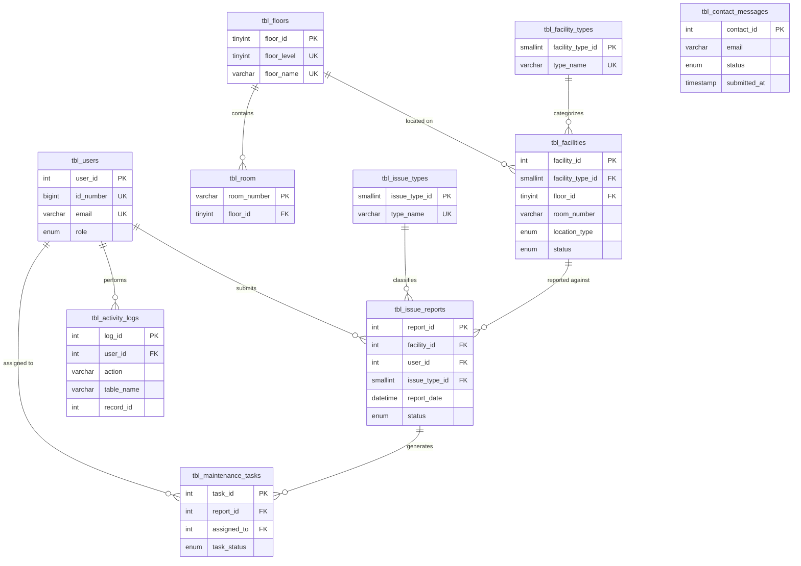

# SpotN'Fix — Database Schema

**DBMS:** MySQL / MariaDB (compatible with TiDB Cloud Serverless)  
**Database name (local):** `spotn_fix`  
**Database name (production):** `spotnfix`  
**Canonical SQL file:** `backend/sql/spotn_fix.sql`  
**Normalization level:** Third Normal Form (3NF)

---

## 1. Purpose

This schema supports the deployed SpotN'Fix system:

- User registration and authentication (students, faculty, admin)
- Facility and room location tracking (8 floors)
- Issue report submission with photos
- Maintenance task assignment
- Admin activity auditing
- Public contact messages (Contact Inbox)

---

## 2. Third Normal Form (3NF) Design

A schema is in **3NF** when:

1. Every column depends only on the **primary key** (1NF + 2NF).
2. No non-key column depends on another non-key column (**no transitive dependencies**).

### How SpotN'Fix satisfies 3NF

| Design decision | 3NF rationale |
|-----------------|---------------|
| `tbl_floors` lookup table | Floor names/levels are stored once; not repeated on every room or facility row. |
| `tbl_facility_types` lookup table | Equipment categories (Television, Printer, etc.) are not duplicated as free text on every facility. |
| `tbl_issue_types` lookup table | Issue labels (Electrical, Plumbing, etc.) are stored once; reports reference `issue_type_id`. |
| `tbl_room` with `floor_id` FK | A room’s floor is determined by FK to `tbl_floors`, not by copying floor name onto the room row. |
| `tbl_facilities` uses `facility_type_id`, `floor_id` | Facility rows reference lookup IDs instead of repeating type/floor names (removes transitive deps). |
| `tbl_issue_reports` uses FKs only | Report stores `facility_id`, `user_id`, `issue_type_id` — not redundant copies of user name, room, or issue label. |
| `tbl_users` separate from reports | Reporter identity lives in `tbl_users`; reports link via `user_id`. |
| `tbl_contact_messages` standalone | Public contact form does not require login; no artificial FK to `tbl_users`. |

### Intentional non-FK note

`tbl_facilities.room_number` is **not** a foreign key to `tbl_room.room_number` because facilities can represent **areas** (`location_type = 'area'`) that are not pre-registered in `tbl_room`. Floor is still normalized via `floor_id` → `tbl_floors`.

---

## 3. Entity-Relationship Overview

**Download:** [`DATABASE_ER_DIAGRAM.pdf`](DATABASE_ER_DIAGRAM.pdf) — 2-page branded PDF (page 1: diagram, page 2: FK map & legend).

Regenerate after schema changes:

```powershell
npm install pdfkit --no-save
node scripts/generate-er-pdf.js
```



---

## 4. Tables — Primary Keys, Foreign Keys, and Columns

### 4.1 `tbl_users`

**Purpose:** Accounts for students, faculty, and administrators.

| Column | Type | Key | Constraints |
|--------|------|-----|-------------|
| `user_id` | INT | **PK** | AUTO_INCREMENT |
| `id_number` | BIGINT | **UK** | NOT NULL — Mapúa student/employee ID |
| `first_name` | VARCHAR(50) | | NOT NULL |
| `last_name` | VARCHAR(50) | | NOT NULL |
| `email` | VARCHAR(100) | **UK** | NOT NULL |
| `password_hash` | VARCHAR(255) | | NOT NULL (bcrypt) |
| `role` | ENUM | | `student`, `faculty`, `admin` — default `student` |
| `created_at` | TIMESTAMP | | DEFAULT CURRENT_TIMESTAMP |

**Primary key:** `user_id`  
**Foreign keys:** none  
**Referenced by:** `tbl_issue_reports.user_id`, `tbl_maintenance_tasks.assigned_to`, `tbl_activity_logs.user_id`

---

### 4.2 `tbl_floors`

**Purpose:** Lookup for building floors (1st–8th).

| Column | Type | Key | Constraints |
|--------|------|-----|-------------|
| `floor_id` | TINYINT UNSIGNED | **PK** | AUTO_INCREMENT |
| `floor_level` | TINYINT UNSIGNED | **UK** | NOT NULL, CHECK 1–8 |
| `floor_name` | VARCHAR(20) | **UK** | NOT NULL (e.g. `6th Floor`) |

**Primary key:** `floor_id`  
**Foreign keys:** none  
**Referenced by:** `tbl_room.floor_id`, `tbl_facilities.floor_id`

---

### 4.3 `tbl_facility_types`

**Purpose:** Lookup for equipment/facility categories.

| Column | Type | Key | Constraints |
|--------|------|-----|-------------|
| `facility_type_id` | SMALLINT UNSIGNED | **PK** | AUTO_INCREMENT |
| `type_name` | VARCHAR(50) | **UK** | NOT NULL |

**Primary key:** `facility_type_id`  
**Foreign keys:** none  
**Referenced by:** `tbl_facilities.facility_type_id`

**Seed values:** Equipment, Furniture, Television, Computer, Microscope, Projector, Lighting, Printer, Air Conditioner, Audio, Appliance, Electronics, Other

---

### 4.4 `tbl_issue_types`

**Purpose:** Lookup for issue categories on reports.

| Column | Type | Key | Constraints |
|--------|------|-----|-------------|
| `issue_type_id` | SMALLINT UNSIGNED | **PK** | AUTO_INCREMENT |
| `type_name` | VARCHAR(100) | **UK** | NOT NULL |

**Primary key:** `issue_type_id`  
**Foreign keys:** none  
**Referenced by:** `tbl_issue_reports.issue_type_id`

**Seed values:** Electrical, Hardware, Supplies, Plumbing, Malfunction, Hardware Failure, Leak, Display Problem, and others (see SQL file)

---

### 4.5 `tbl_room`

**Purpose:** Known rooms and their floor assignment.

| Column | Type | Key | Constraints |
|--------|------|-----|-------------|
| `room_number` | VARCHAR(20) | **PK** | NOT NULL |
| `floor_id` | TINYINT UNSIGNED | **FK** | NOT NULL → `tbl_floors(floor_id)` |
| `side` | VARCHAR(10) | | NULL — e.g. `left`, `right` |

**Primary key:** `room_number`  
**Foreign keys:**

| FK name | Column | References |
|---------|--------|------------|
| `tbl_room_ibfk_1` | `floor_id` | `tbl_floors(floor_id)` |

---

### 4.6 `tbl_facilities`

**Purpose:** Equipment or assets at a floor/room or area.

| Column | Type | Key | Constraints |
|--------|------|-----|-------------|
| `facility_id` | INT | **PK** | AUTO_INCREMENT |
| `facility_name` | VARCHAR(100) | | NOT NULL (e.g. `Projector`, `Television #10`) |
| `facility_type_id` | SMALLINT UNSIGNED | **FK** | NOT NULL → `tbl_facility_types(facility_type_id)` |
| `floor_id` | TINYINT UNSIGNED | **FK** | NOT NULL → `tbl_floors(floor_id)` |
| `room_number` | VARCHAR(20) | | NOT NULL — room number or area name |
| `location_type` | ENUM | | `room` or `area` |
| `status` | ENUM | | `Operational`, `Faulty`, `Under Maintenance` |

**Primary key:** `facility_id`  
**Foreign keys:**

| FK name | Column | References |
|---------|--------|------------|
| `tbl_facilities_ibfk_1` | `facility_type_id` | `tbl_facility_types(facility_type_id)` |
| `tbl_facilities_ibfk_2` | `floor_id` | `tbl_floors(floor_id)` |

**Referenced by:** `tbl_issue_reports.facility_id`

---

### 4.7 `tbl_issue_reports`

**Purpose:** User-submitted facility issue reports.

| Column | Type | Key | Constraints |
|--------|------|-----|-------------|
| `report_id` | INT | **PK** | AUTO_INCREMENT |
| `facility_id` | INT | **FK** | NOT NULL → `tbl_facilities(facility_id)` |
| `user_id` | INT | **FK** | NOT NULL → `tbl_users(user_id)` |
| `issue_type_id` | SMALLINT UNSIGNED | **FK** | NOT NULL → `tbl_issue_types(issue_type_id)` |
| `description` | TEXT | | NOT NULL |
| `photo_path` | VARCHAR(255) | | NULL — uploaded evidence path |
| `report_date` | DATETIME | | DEFAULT CURRENT_TIMESTAMP |
| `status` | ENUM | | `Pending`, `In Progress`, `Resolved` |

**Primary key:** `report_id`  
**Foreign keys:**

| FK name | Column | References |
|---------|--------|------------|
| `tbl_issue_reports_ibfk_1` | `facility_id` | `tbl_facilities(facility_id)` |
| `tbl_issue_reports_ibfk_2` | `user_id` | `tbl_users(user_id)` |
| `tbl_issue_reports_ibfk_3` | `issue_type_id` | `tbl_issue_types(issue_type_id)` |

**Referenced by:** `tbl_maintenance_tasks.report_id`

**Application mapping:** `Pending` → Open, `In Progress` → In Progress, `Resolved` → Resolved (hidden from student/faculty list UI)

---

### 4.8 `tbl_maintenance_tasks`

**Purpose:** Maintenance work linked to a report and assigned staff.

| Column | Type | Key | Constraints |
|--------|------|-----|-------------|
| `task_id` | INT | **PK** | AUTO_INCREMENT |
| `report_id` | INT | **FK** | NOT NULL → `tbl_issue_reports(report_id)` |
| `assigned_to` | INT | **FK** | NOT NULL → `tbl_users(user_id)` |
| `task_status` | ENUM | | `Assigned`, `In Progress`, `Completed` |
| `started_at` | DATETIME | | NULL |
| `completed_at` | DATETIME | | NULL |

**Primary key:** `task_id`  
**Foreign keys:**

| FK name | Column | References |
|---------|--------|------------|
| `tbl_maintenance_tasks_ibfk_1` | `report_id` | `tbl_issue_reports(report_id)` |
| `tbl_maintenance_tasks_ibfk_2` | `assigned_to` | `tbl_users(user_id)` |

---

### 4.9 `tbl_activity_logs`

**Purpose:** Audit trail for create/update/delete actions.

| Column | Type | Key | Constraints |
|--------|------|-----|-------------|
| `log_id` | INT | **PK** | AUTO_INCREMENT |
| `user_id` | INT | **FK** | NOT NULL → `tbl_users(user_id)` |
| `action` | VARCHAR(255) | | NOT NULL — e.g. CREATE, UPDATE, LOGIN |
| `table_name` | VARCHAR(50) | | NOT NULL — affected table |
| `record_id` | INT | | NOT NULL — affected row ID |
| `old_value` | TEXT | | NULL — JSON snapshot before change |
| `new_value` | TEXT | | NULL — JSON snapshot after change |
| `timestamp` | TIMESTAMP | | DEFAULT CURRENT_TIMESTAMP |

**Primary key:** `log_id`  
**Foreign keys:**

| FK name | Column | References |
|---------|--------|------------|
| `tbl_activity_logs_ibfk_1` | `user_id` | `tbl_users(user_id)` |

---

### 4.10 `tbl_contact_messages`

**Purpose:** Messages from the public Contact us form (admin inbox).

| Column | Type | Key | Constraints |
|--------|------|-----|-------------|
| `contact_id` | INT | **PK** | AUTO_INCREMENT |
| `first_name` | VARCHAR(50) | | NOT NULL |
| `last_name` | VARCHAR(50) | | NOT NULL |
| `email` | VARCHAR(100) | | NOT NULL |
| `subject` | VARCHAR(150) | | NOT NULL |
| `message` | TEXT | | NOT NULL |
| `status` | ENUM | | `New`, `Read`, `Archived` |
| `submitted_at` | TIMESTAMP | | DEFAULT CURRENT_TIMESTAMP |

**Primary key:** `contact_id`  
**Foreign keys:** none (submitter may not have an account)

---

## 5. Primary Key Summary

| Table | Primary Key |
|-------|-------------|
| `tbl_users` | `user_id` |
| `tbl_floors` | `floor_id` |
| `tbl_facility_types` | `facility_type_id` |
| `tbl_issue_types` | `issue_type_id` |
| `tbl_room` | `room_number` |
| `tbl_facilities` | `facility_id` |
| `tbl_issue_reports` | `report_id` |
| `tbl_maintenance_tasks` | `task_id` |
| `tbl_activity_logs` | `log_id` |
| `tbl_contact_messages` | `contact_id` |

---

## 6. Foreign Key Summary

| Child table | FK column | Parent table | Parent column | Constraint name |
|-------------|-----------|--------------|---------------|-----------------|
| `tbl_room` | `floor_id` | `tbl_floors` | `floor_id` | `tbl_room_ibfk_1` |
| `tbl_facilities` | `facility_type_id` | `tbl_facility_types` | `facility_type_id` | `tbl_facilities_ibfk_1` |
| `tbl_facilities` | `floor_id` | `tbl_floors` | `floor_id` | `tbl_facilities_ibfk_2` |
| `tbl_issue_reports` | `facility_id` | `tbl_facilities` | `facility_id` | `tbl_issue_reports_ibfk_1` |
| `tbl_issue_reports` | `user_id` | `tbl_users` | `user_id` | `tbl_issue_reports_ibfk_2` |
| `tbl_issue_reports` | `issue_type_id` | `tbl_issue_types` | `issue_type_id` | `tbl_issue_reports_ibfk_3` |
| `tbl_maintenance_tasks` | `report_id` | `tbl_issue_reports` | `report_id` | `tbl_maintenance_tasks_ibfk_1` |
| `tbl_maintenance_tasks` | `assigned_to` | `tbl_users` | `user_id` | `tbl_maintenance_tasks_ibfk_2` |
| `tbl_activity_logs` | `user_id` | `tbl_users` | `user_id` | `tbl_activity_logs_ibfk_1` |

**Total:** 9 foreign key relationships across 10 tables.

---

## 7. Referential Integrity & Delete Behavior

The application deletes related rows in order when removing a user account:

1. `tbl_maintenance_tasks` (by `report_id` and `assigned_to`)
2. `tbl_issue_reports` (by `user_id`)
3. `tbl_activity_logs` (by `user_id`)
4. `tbl_users`

MySQL/InnoDB default is **RESTRICT** on FK delete — the app handles cascades in application code (`DELETE /api/auth/account`).

---

## 8. How to Create / Reset the Schema

**Local (XAMPP):**

```powershell
cd C:\Users\aifos\spotnfix
npm run db:setup
```

Or import `backend/sql/spotn_fix.sql` in phpMyAdmin.

**Production (TiDB):** Same `npm run db:setup` with `backend/.env` pointing at TiDB (see `GO_LIVE.md`).

---

## 9. Files in This Repository

| File | Role |
|------|------|
| `backend/sql/spotn_fix.sql` | Full DDL + seed lookups |
| `backend/scripts/import-schema.js` | Cloud-safe import (strips CREATE DATABASE) |
| `backend/src/seed.js` | Sample users, rooms, facilities, reports |
| `DATABASE_SCHEMA.md` | This document |

---

*Schema matches the working SpotN'Fix deployment as of the current `main` branch.*
